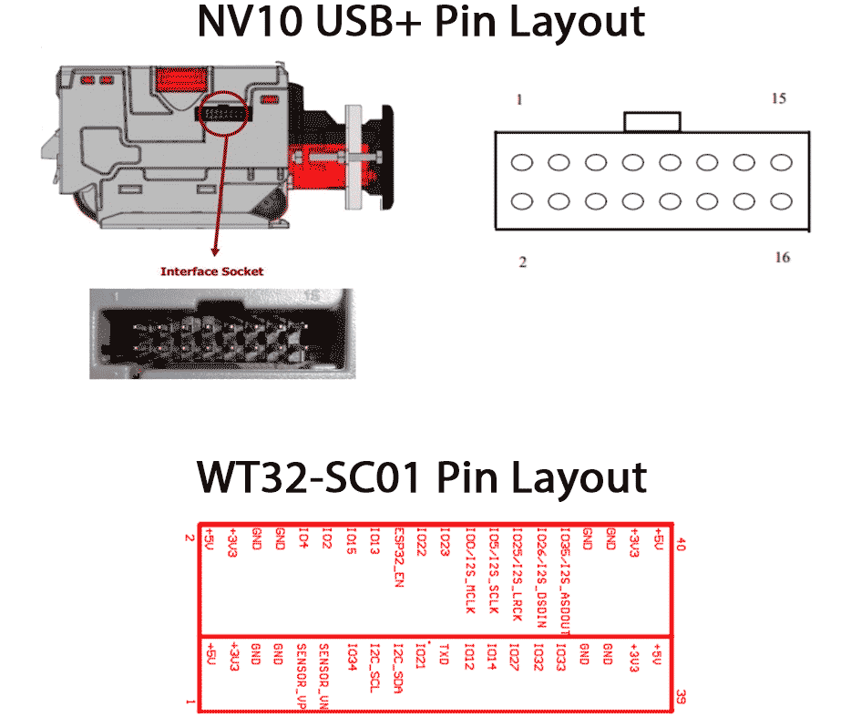

## OFFLINE, FOSS, CHEAP, BILLS/COINS, EASY CONFIG WEB PORTAL 

> <i>Join our <a href="https://t.me/makerbits">telegram support/chat</a>.</i>

## Demo

https://twitter.com/arcbtc/status/1567639231333277697

## Bill of Materials

The parts for this ATM should be approximately £200-£250!

You can run the FOSSA as either coin machine and bill acceptor, or either on their own.

### Primary FOSSA components

| Part    | Description    | Buy (UK)    | Estimated cost |
|-------------|-------------|-------------|-------------|
| ESP32 WT32-SC01 | This is the ESP32 touchscreen. No wifi required. Should be supplied with a USB-C to USB cable | Ebay or [AliExpress](https://www.aliexpress.com/item/1005003191471709.html) | **£45** |
| Option: NV10USB+ bill acceptor | The bill acceptor option to account cash notes. To accept GBP request that it be set to GBP and SIO mode. | [Ebay (second hand)](https://www.ebay.co.uk/itm/263398460026) | **£70-£150** |
| Option: DG600F(S) Multi Coin Acceptor | The coin acceptor option. The "S" denotes the front panel (stainless steel sheet version, where we can 3D print a black panel for it). | [AliExpress](https://www.aliexpress.com/w/wholesale-DG600F(S)-Multi-Coin-Acceptor.html?spm=a2g0o.home.search.0) or Ebay (second-hand) | **£30** |
| Screw terminal block | Easily connect the wires without soldering. | [Amazon (UK)](https://www.amazon.co.uk/gp/product/B08LNWMMHQ) | **£1** |
| 12v power supply | Best to get one with terminal block adapter (12v battery also works well, for unplugged version). | [Amazon (UK)](https://www.amazon.co.uk/gp/product/B09MTBTXDJ/) | **£8** |
| 12v to 5v step down converter with USB | 12V TO 5V:The USB charger adapter converter module can convert unstable voltage DC 12V to stable DC 5V / 15W 3A output. | [Amazon (UK)](https://www.amazon.co.uk/gp/product/B07QQ587K3) | **£5**
| Male-to-female GPIO jumpers | Plug and play GPIO connectors | [Amazon (UK)](https://www.amazon.co.uk/gp/product/B09MJZDXBB) | **£5**
| Option: Aluminum "medicine box" | Cheap medicine box for the cash machine | Amazon (UK) | **£30** |
| Option: Amazon Basic Home Safe | More secure box | Amazon (UK) | **£70** |
| Option: 58mm 701 USB Thermal Receipt Printer | Print receipts for users. **NB The 3D printed enclosure does not currently fit this**. | [Ebay (UK)](https://www.ebay.co.uk/itm/293668439213) | **£25** |

### 3D printed enclosure fixtures & fittings

For the 3D printed version, you will need:

| Part    | Description    | Buy (UK)    |
|-------------|-------------|-------------|
| M4 x 16mm pan head security torx tamper resistant bolts | These hold the front facia to the back box. Anything longer than 14mm - 55mm is fine. | [Amazon (UK)](https://www.amazon.co.uk/gp/product/B0BTTRPBQV/) |
| Tamper-proof torx wrench (T20) | To tighten the front facia Torx bolts. | [Amazon (UK)](https://www.amazon.co.uk/gp/product/B0D53LNNRW) |
| Female threaded heat set knurled embedded insert nuts, M4 x 6mm L x 6mm OD | Using a soldering iron, these are heated up and pushed into the back box for better attachment of the facia. | [Amazon (UK)](https://www.amazon.co.uk/gp/product/B09MCVW4GQ/) |
| M4 x 30mm carriage/coach bolts | These are to replace the bolts supplied with the coin acceptor to accommodate the thickness of the facia. | [Amazon (UK)](https://www.ebay.co.uk/itm/386550912089?var=653926055961) |
| 5.5mm x 2.1mm DC Power Jack Socket Female Panel Mount Connector | This allows the 12V adaptor to plug into the ATM's outside. The box assumes a diameter of 7.7mm (like these). | [Amazon (UK)](https://www.amazon.co.uk/dp/B01N3679B8) |
| Cabinet draw tubular 16mm lock | This will be mounted on the door. | [Amazon (UK)](https://www.amazon.co.uk/Litensh-Tubular-Cylinder-Cupboard-Letterbox/dp/B09SHWXWXC/) |
| Optional: Rubber feet (D30x22xH15) | If you want to have this one on the table, some rubber feet will go at the bottom of the backbox with an M5 bolt. You can also use adhesive versions. Grooves in the bottom of the box will support up to 30mm in diameter. | [Amazon (UK)](https://www.amazon.co.uk/dp/B0CQ23M5Z5) |
| Optional: M5 x 16mm hex socket bolts | To screw the rubber feet into the back box. | [Amazon (UK)](https://www.amazon.co.uk/16mm-Socket-Button-Head-Screws/dp/B09BG8XNM7) |
| Optional: M5 nylon nuts | To screw the rubber feet into the backbox. | [Amazon (UK)](https://www.amazon.co.uk/Bolt-Base-Stainless-Insert-Nylock) |
| Optional: Adhesive security plate and locking cable | Secure the ATM when desk mounted. | [Amazon (UK)](https://www.amazon.co.uk/I3C-Security-Anti-Theft-Hardware-Smartphone/dp/B07FM93JL6) |

## Construction

A video tutorial is available here on how to construct the FOSSA:

[https://www.youtube.com/watch?v=vbyYb9Yiu_k](https://www.youtube.com/watch?v=vbyYb9Yiu_k)

### WT32-SC01 Pinmap

### Coin acceptor wiring

> You can usually order the coin acceptor pre-programmed to your currencies, otherwise you will need to train the acceptor using <a href="https://www.youtube.com/watch?v=Dyun1xjKqc4">this guide</a>.

### Bill acceptor wiring

| NV10USB+ Pin | WT32-SC01 Pin No. (Not GPIO No.) | Power Supply   |
|----------|-----------|----------------|
| 1 (Tx)  | 31         | Do not connect |
| 5 (Rx)  | 29         | Do not connect |
| 15 (12V DC+) | Do not connect | 12V DC+ |
| 16 (GND) | 5         | GND            |

> The bill acceptor needs to be programmed to your currency and set to `SIO` mode, usually you can buy them preconfigured. If you have to program, buy <a href="https://www.innovative-technology.com/shop/cables/nv9-nv10-usb-host-cable-detail">this wire</a> and download the Validator Manager software <a href="https://www.dropbox.com/sh/2mle0czl2j2w7yq/AABie6AJQTq-tXmBv1TUhBUGa?dl=0">here</a> or <a href="http://www.innovative-technology.com/support/secure-download">here</a> (sadly only runs on windows, so use a friends machine). Details on programming can be found <a href="https://github.com/arcbtc/fossa/blob/main/NV10Manual_2.PDF.pdf">here</a>. Its relatively straight forward to program, plug in USB host cable, turn on holding config button for 2 secs, open the Validator Manager software.

Page 42 of the <a href="NV10 operations manual.pdf">NV10 USB Operations Manual</a> shows a wiring diagram for the NV10 USB host cable if you want to build your own programming cable.

> (Ignore all the hardware requirements for programming in the guide, you just need the host cable! Don't try using the programming cards in the guide, thats an old system these machines no longer support "Many Bothans died to bring us this information,")

### OPTIONAL: 3D printed enclosure

#### Facia

1. Print the Facia
  - STL: [FOSSA ATM Facia](https://github.com/lnbits/fossa/blob/main/3DPrints/FOSSA%20ATM%20Facia.stl)
  - Material: PETG
  - Infill: 0-100%
  - Supports: No
2. Print the backbox
  - STL: [FOSSA ATM Back box](https://github.com/lnbits/fossa/blob/main/3DPrints/FOSSA%20ATM%20Back%20Box.stl)  
  - Material: PETG  
  - Infill: 0-100%  
  - Supports: Yes (you "paint" out all but the door in Prusa slicer)  
3. Once printed, use a soldering iron to melt the brass female embedded insert nuts into the 6 holes for the facia.
4. OPTIONAL: If using the coin acceptor, replace the coach bolts with longer bolts (M4 x 30mm carriage/coach bolts) to account for the thickness of the facia.

### OPTIONAL: Mounting in box

Use the templates provided <a href="cuttingTemplate.pdf">here</a>. print out at 100% on standard UK A4, and check the dimensions are correct after printing. Its useful if the pins on the bill acceptor and coin mech are accessible.

* For the `Aluminim Storage Box` solution, holes can be cut with a sharp knife (clearly not secure, but fine for somewhere you can keep an eye on the ATM or for demoes).

* For the `Home Safe` solution, holes can be cut with angle grinder and a very thin cutter. (If you have not used an angle grinder before, don't be scared, they're cheap, easy enought to use, and very useful. Just take your time and wear safetly equipment.)

We use CT1 sealent/adhesive (or similar) for mounting screen, although the screen has screw points, which should prob be used for added security.

## Installing arduino + libraries

Install the Arduino IDE, 
https://www.arduino.cc/en/Main/Software

Install the ESP32 hardware, 
https://github.com/espressif/arduino-esp32#installation-instructions

Copy the libraries from this projects <a href="/libraries">libraries</a> folder, to your `"/Arduino/libraries"` folder (usually in OS `"Home"` directory)

